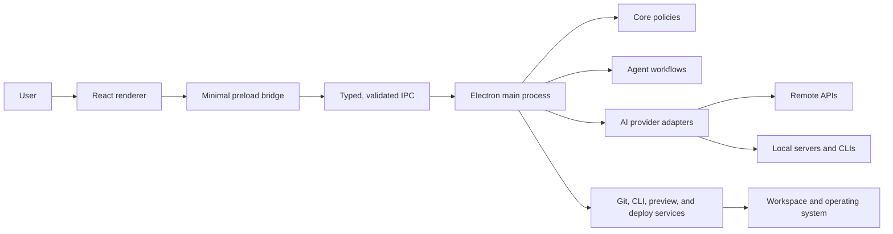

<div align="center">

```
  ██╗   ██╗███╗   ██╗███████╗ ██████╗ ██████╗ ██████╗ ███████╗
  ██║   ██║████╗  ██║██╔════╝██╔════╝██╔═══██╗██╔══██╗██╔════╝
  ██║   ██║██╔██╗ ██║███████╗██║     ██║   ██║██║  ██║█████╗
  ╚██╗ ██╔╝██║╚██╗██║╚════██║██║     ██║   ██║██║  ██║██╔══╝
   ╚████╔╝ ██║ ╚████║███████║╚██████╗╚██████╔╝██████╔╝███████╗
    ╚═══╝  ╚═╝  ╚═══╝╚══════╝ ╚═════╝ ╚═════╝ ╚═════╝ ╚══════╝
```

**Build with every AI. Manage everything from one place.**

[](https://github.com/spxmiguel/visualnscode/actions/workflows/lint.yml)
[](https://github.com/spxmiguel/visualnscode/actions/workflows/unit-tests.yml)
[](https://github.com/spxmiguel/visualnscode/actions/workflows/lighthouse.yml)
[](https://github.com/spxmiguel/visualnscode/actions/workflows/codeql.yml)
[](./LICENSE)
[](./package.json)
[](./CONTRIBUTING.md)

[Português](./docs/README.pt-BR.md) · [Getting started](./docs/getting-started.md) · [Architecture](./docs/architecture.md) · [Roadmap](./ROADMAP.md)

</div>

---

VisualnsCode is an open-source desktop IDE for people who want one place for AI providers, local
models, coding agents, project tools, Git, previews, and deploys. It keeps the first experience
approachable without hiding the controls experienced developers need.

The problem is not a shortage of developer tools. It is the setup, context switching, inconsistent
permissions, and fragmented history between them. VisualnsCode provides one workspace with explicit
security boundaries and plain-language actions.

## Who it is for

- Beginners and vibe coders who need a guided path from an idea to a running project.
- Developers who use several AI providers or local models and want a consistent interface.
- Teams that need visible agent workflows, reviewable file changes, and reproducible project tools.

## Features

| Area                   | What is available                                                                                                               |
| ---------------------- | ------------------------------------------------------------------------------------------------------------------------------- |
| AI providers           | OpenAI, Anthropic, Gemini, OpenRouter, Ollama, LM Studio, OpenAI-compatible endpoints, and five CLI adapters                    |
| Streaming chat         | Cancel, retry, model/provider labels, context files, usage estimate, local history, export, and clear                           |
| Agent teams            | Ten built-in roles, custom agents, sequential and parallel workflows, budgets, retries, timeouts, and rollback hooks            |
| Safe editing           | Reviewable side-by-side or unified diffs, hunk selection, checkpoints, snapshots, rollback, path controls, and secret redaction |
| Guided projects        | Plain-language suggestions and 13 versioned templates with optional Git, GitHub, installation, run, and preview steps           |
| Git and GitHub         | Simple labels for beginners plus status, branches, commits, conflicts, issues, pull requests, Actions, and releases             |
| Runtime and preview    | Detect npm, pnpm, Yarn, Bun, Python, and static projects; run fixed actions; inspect logs and select preview elements           |
| Confirmed deploys      | Vercel, Firebase Hosting, Supabase, and GitHub Pages plans with build validation and production confirmation                    |
| Two interface modes    | A focused Simple mode and an Advanced mode with terminal, Git, logs, diffs, tasks, models, and permissions                      |
| Environment onboarding | Detects 19 development tools and guides setup through named, permission-checked actions                                         |

## Screenshots

These images are captured from the current desktop application, not a design mockup.

### Home and recent projects


### Workspace


### First-run setup


## Current status

VisualnsCode is in active alpha development at version `0.1.0`. The repository contains a functional
Electron application, landing page, shared packages, automated tests, and cross-platform packaging
configuration. Core workflows are implemented, but the project is not yet a signed, production-ready
release: there is no public binary release today, packaged-app testing is limited, and the plugin API,
automatic updates, and SQLite migration are still planned.

Build from source for evaluation and development. Do not use the current alpha as the only copy of
important work.

## Requirements

- Node.js 20.18 or newer.
- pnpm 9.x. The repository pins `pnpm@9.15.0` in `package.json`.
- Git.
- macOS, Windows, or Linux for the desktop app.
- Optional provider credentials or a running local provider such as Ollama or LM Studio.

## Install from source

```bash
git clone https://github.com/spxmiguel/visualnscode.git
cd visualnscode
pnpm install --frozen-lockfile
```

Public installer scripts already exist in `scripts/`, but they intentionally depend on a published
GitHub release. Use them only after the first release appears on the
[Releases page](https://github.com/spxmiguel/visualnscode/releases).

## Run

```bash
# Electron desktop app
pnpm dev

# Landing page only
pnpm dev:landing

# Shared UI catalog
pnpm dev:ui
```

## Build

```bash
# Build every workspace that defines a build script
pnpm build

# Package the desktop app for the current operating system
pnpm --filter @visualnscode/desktop release
```

Platform-specific packaging commands are documented in [Releases](./docs/releases.md). Local
artifacts are written to `release/` and are unsigned unless signing credentials are configured.

## Test and verify

```bash
pnpm docs:check
pnpm format:check
pnpm lint
pnpm typecheck
pnpm test
pnpm test:coverage
pnpm test:e2e
pnpm test:lighthouse
pnpm build
pnpm security:audit
```

The E2E suite starts the applications it needs. Lighthouse builds and serves the landing page through
its checked-in configuration. Coverage is reported separately for unit and main-service integration
tests. See [Testing](./docs/testing.md) for focused commands and the
[final audit](./docs/audit-report.md) for measured results and open risks.

## Architecture

The renderer has no direct Node.js access. It requests named capabilities through the preload bridge;
the Electron main process validates input and owns filesystem, command, credential, provider, preview,
Git, and deployment services. Domain packages remain independent from React and Electron.



The monorepo keeps the desktop app and landing page separate while sharing stable contracts:

```text
visualnscode/
├── apps/
│   ├── desktop/          # Electron main, preload, and React renderer
│   ├── landing/          # Vite + React public website
│   └── ui-docs/          # Lightweight component catalog
├── packages/
│   ├── agents/           # Agent definitions and workflow engine
│   ├── config/           # Shared constants
│   ├── core/             # Pure security and domain rules
│   ├── integrations/     # Tool, Git, filesystem, and deploy contracts
│   ├── providers/        # Universal AI provider layer
│   ├── types/            # Cross-package serializable types
│   └── ui/               # Shared React components
├── docs/                 # Product and engineering documentation
└── scripts/              # Repository, installer, and audit scripts
```

Read the [full architecture](./docs/architecture.md), [security model](./docs/security-model.md), and
[Architecture Decision Records](./docs/decisions/README.md).

## Documentation

Start with the [documentation index](./docs/README.md). It links setup, architecture, providers,
agents, integrations, templates, deployment, troubleshooting, testing, and release documentation.
Extension guides cover adding a [provider](./docs/providers.md#adding-a-provider),
[integration](./docs/integrations.md#adding-an-integration),
[template](./docs/project-templates.md#adding-a-template),
[agent](./docs/agents.md#adding-an-agent-programmatically), and the proposed
[future plugin contract](./docs/plugins.md).

## Roadmap

| Track                                                                    | Status               |
| ------------------------------------------------------------------------ | -------------------- |
| Monorepo, desktop workspace, onboarding, providers, agents, safe editing | Implemented in alpha |
| Guided projects, Git/GitHub, runtime preview, confirmed deployment       | Implemented in alpha |
| Packaged-app QA, signing, notarization, auto-update                      | In progress          |
| SQLite persistence, terminal UI completion, plugin SDK                   | Planned              |

The detailed scope and known limitations live in [ROADMAP.md](./ROADMAP.md).

## Contributing

Issues, documentation improvements, tests, and code contributions are welcome. Read
[CONTRIBUTING.md](./CONTRIBUTING.md), run the required checks, use Conventional Commits, and review
the credential-safety checklist before pushing a branch.

## Security

VisualnsCode stores provider secrets with Electron `safeStorage`, prevents the renderer from reading
them, redacts sensitive content before remote requests, validates workspace paths, and classifies local
commands. Workspace processes receive a credential-free environment, remote providers require HTTPS,
and extreme destructive commands remain blocked even when YOLO mode is enabled.

Report vulnerabilities privately as described in [SECURITY.md](./SECURITY.md). The detailed threat
model and limitations are in [docs/security-model.md](./docs/security-model.md).

## License

VisualnsCode is available under the [MIT License](./LICENSE). Copyright © 2026
[@spxmiguel](https://github.com/spxmiguel).
