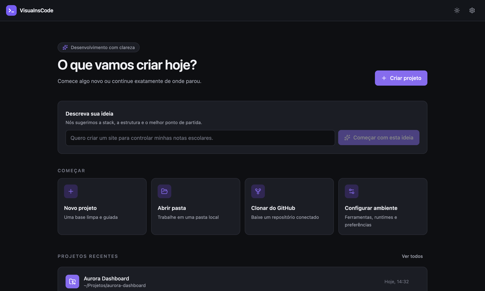
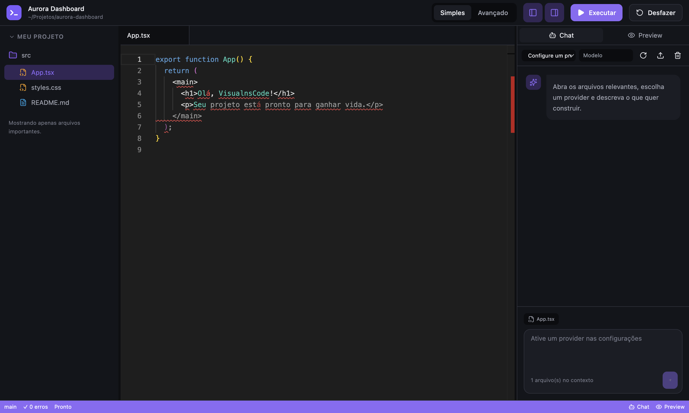
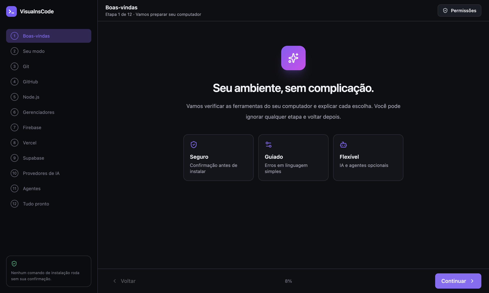

<div align="center">

```
  ██╗   ██╗███╗   ██╗███████╗ ██████╗ ██████╗ ██████╗ ███████╗
  ██║   ██║████╗  ██║██╔════╝██╔════╝██╔═══██╗██╔══██╗██╔════╝
  ██║   ██║██╔██╗ ██║███████╗██║     ██║   ██║██║  ██║█████╗
  ╚██╗ ██╔╝██║╚██╗██║╚════██║██║     ██║   ██║██║  ██║██╔══╝
   ╚████╔╝ ██║ ╚████║███████║╚██████╗╚██████╔╝██████╔╝███████╗
    ╚═══╝  ╚═╝  ╚═══╝╚══════╝ ╚═════╝ ╚═════╝ ╚═════╝ ╚══════╝
```

**Crie com todas as IAs. Gerencie tudo em um só lugar.**

[English](../README.md) · [Primeiros passos](./getting-started.md) · [Arquitetura](./architecture.md) · [Roadmap](../ROADMAP.md)

</div>

---

VisualnsCode é uma IDE desktop open source que reúne provedores de IA, modelos locais, agentes,
ferramentas de projeto, Git, preview e deploy. O modo Simples oferece um caminho guiado para quem está
começando; o modo Avançado mantém controles detalhados para desenvolvedores experientes.

## Para quem é

- Iniciantes e vibe coders que querem ir da ideia a um projeto funcionando sem configurar tudo à mão.
- Desenvolvedores que alternam entre várias IAs, modelos locais e ferramentas de terminal.
- Equipes que precisam visualizar agentes, revisar alterações e manter ações reproduzíveis.

## Principais recursos

| Área             | O que está disponível                                                                             |
| ---------------- | ------------------------------------------------------------------------------------------------- |
| Providers        | OpenAI, Anthropic, Gemini, OpenRouter, Ollama, LM Studio, endpoint OpenAI compatível e cinco CLIs |
| Chat             | Streaming, cancelar, reenviar, arquivos de contexto, consumo estimado, histórico e exportação     |
| Agentes          | Dez papéis padrão, agentes personalizados, fluxos paralelos/sequenciais, custos, retry e timeout  |
| Edição segura    | Diff lado a lado/unificado, seleção por bloco, checkpoints, snapshots, rollback e redaction       |
| Projetos         | Sugestão local em linguagem simples e 13 templates versionados                                    |
| Git e GitHub     | Modo simples e operações avançadas, sempre sem push automático                                    |
| Preview e deploy | Execução detectada, preview integrado, seletor de elemento e quatro destinos confirmados          |
| Onboarding       | Detecção de 19 ferramentas, permissões separadas e credenciais protegidas pelo sistema            |

## Capturas reais

Estas imagens foram capturadas da aplicação desktop atual; não são mockups de design.







## Estado atual

O projeto está em desenvolvimento alpha na versão `0.1.0`. O app Electron, a landing page, os pacotes
compartilhados, testes e a configuração de instaladores são funcionais. Ainda não existe uma release
binária pública. Assinatura, notarização, atualização automática, migração para SQLite, terminal
interativo completo e API de plugins continuam pendentes.

Use o código-fonte para desenvolvimento e avaliação. Não mantenha trabalho importante apenas nesta
versão alpha.

## Requisitos e instalação

- Node.js 20.18 ou mais recente.
- pnpm 9.x; o repositório fixa `pnpm@9.15.0`.
- Git.
- macOS, Windows ou Linux.

```bash
git clone https://github.com/spxmiguel/visualnscode.git
cd visualnscode
corepack enable
pnpm install --frozen-lockfile
pnpm dev
```

Os scripts públicos em `scripts/` dependem de uma release no GitHub e só poderão instalar o aplicativo
depois da primeira publicação aprovada.

## Desenvolvimento

```bash
pnpm dev              # aplicativo desktop
pnpm dev:landing      # landing page
pnpm dev:ui           # catálogo de componentes
pnpm build            # build de todos os workspaces
```

Verificação completa:

```bash
pnpm docs:check
pnpm format:check
pnpm lint
pnpm typecheck
pnpm test
pnpm test:e2e
pnpm test:lighthouse
pnpm build
pnpm security:audit
```

## Arquitetura resumida

O renderer React não acessa Node.js diretamente. Ele envia pedidos tipados pela ponte preload; o
processo principal valida os dados e concentra arquivos, comandos, credenciais, providers, Git,
preview e deploy. Pacotes de domínio não dependem da interface nem do Electron.

```text
apps/desktop   Aplicativo Electron
apps/landing   Site público separado
apps/ui-docs   Catálogo visual
packages/*     Core, providers, agentes, integrações, tipos e UI compartilhada
docs/          Documentação e ADRs
```

Leia [architecture.md](./architecture.md), [security-model.md](./security-model.md) e o
[índice da documentação](./README.md).

## Segurança

Chaves são criptografadas com Electron `safeStorage` e não voltam ao renderer. Contexto remoto passa
por detecção e redação de segredos. Caminhos, symlinks e comandos são validados; comandos destrutivos
extremos continuam bloqueados no modo YOLO. Nunca faça push ou deploy de produção sem confirmação.

Relate vulnerabilidades de forma privada conforme [SECURITY.md](../SECURITY.md).

## Contribuição, roadmap e licença

Leia [CONTRIBUTING.md](../CONTRIBUTING.md), use Conventional Commits, adicione um Changeset quando a
mudança afetar usuários e execute as verificações antes do pull request. Os próximos marcos estão em
[ROADMAP.md](../ROADMAP.md). O projeto usa a [licença MIT](../LICENSE) e é mantido por
[@spxmiguel](https://github.com/spxmiguel).
