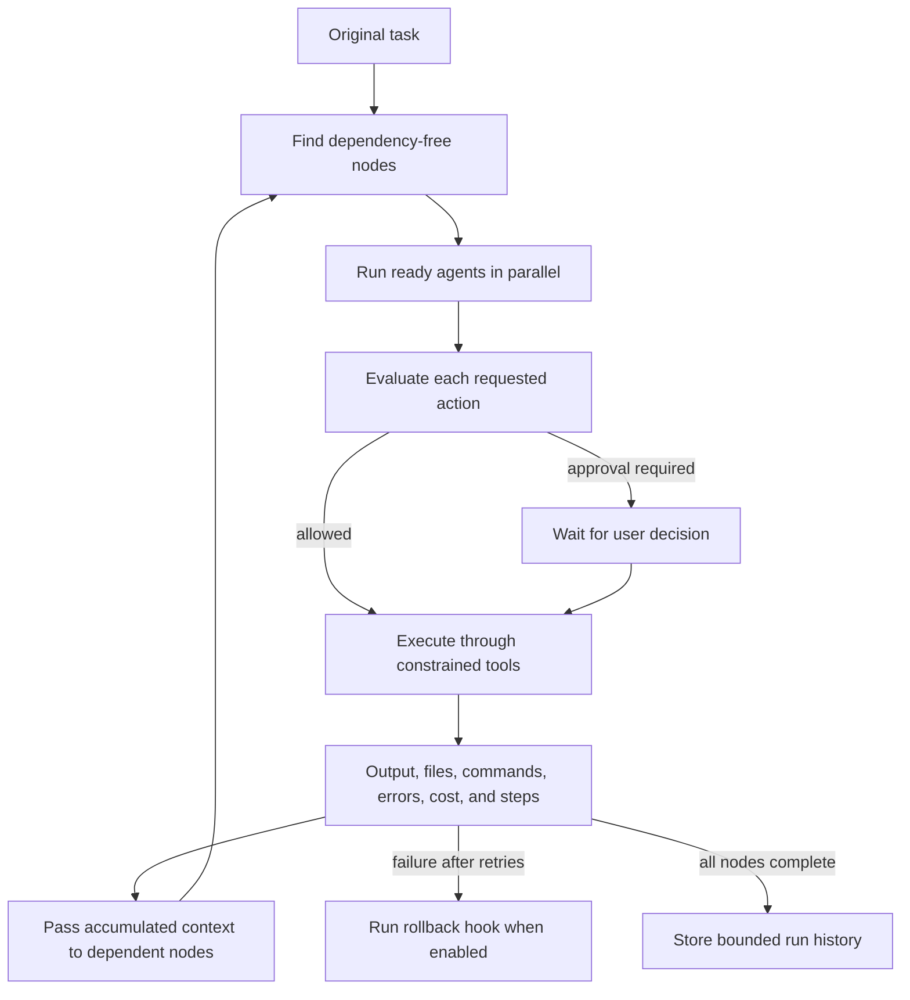

# Agents and workflows

An agent definition combines a role, provider/model choice, system prompt, allowed tools and folders,
cost/time limits, memory scope, autonomy, terminal permission, and edit permission. The workflow
engine consumes definitions without giving them unrestricted operating-system access.

## Built-in agents

| Agent                | Purpose                                           | Default autonomy |
| -------------------- | ------------------------------------------------- | ---------------- |
| Architect            | Define boundaries and an implementation plan      | Guided           |
| Frontend Developer   | Build accessible, responsive interfaces           | Guided           |
| Backend Developer    | Build validated services and domain logic         | Guided           |
| Debugger             | Reproduce failures and identify root causes       | Ask              |
| Reviewer             | Review correctness, security, and maintainability | Guided           |
| Tester               | Create and run risk-proportional tests            | Guided           |
| Documentation Writer | Keep behavior and limits documented               | Guided           |
| Security Auditor     | Audit permissions, secrets, and attack surfaces   | Ask              |
| DevOps               | Build CI and confirmed deployment plans           | Ask              |
| Project Manager      | Organize scope and acceptance criteria            | Guided           |

Defaults use Ollama's `default` model, a USD 2 run budget, a three-minute timeout, run-scoped memory
with at most 20 entries, and workspace-relative folders. Users can override these values or create a
custom agent in the Agents panel.

## Autonomy levels

- **Ask:** every action waits for approval.
- **Guided:** safe actions can proceed; important or destructive actions wait for approval.
- **Autonomous:** actions can proceed inside the declared permissions, but global security invariants
  still apply. It is not unrestricted execution.

An agent's autonomy cannot grant a tool, folder, terminal level, or edit level omitted from its
definition. Production deployment, repository push, pull-request creation, credential access, and
blocked destructive commands retain their separate gates.

## Workflow data flow



Nodes without an unmet dependency form a parallel stage. Dependent nodes receive the original task,
previous results, changed files, errors, and relevant key/value context. Runs enforce workflow-wide
cost, time, step, retry, and cancellation limits. Events make active work, file access, proposed
commands, elapsed time, and spend visible to the UI.

## Team templates

The visual workflow panel includes Full Stack App, Landing Page, Bug Fix, Code Review, Test Generator,
Documentation, and Deploy templates. Nodes can be dragged and connected into a directed acyclic graph.
Cycles and missing agent references are rejected before execution.

## Version-control options

An agent task may create a local checkpoint, isolated branch, reviewed Conventional Commit, and draft
pull request. Push and pull-request creation each require their own explicit task-level confirmation.
No autonomy level enables push by default.

## Adding an agent programmatically

Add a definition through `packages/agents/src/defaults.ts` using the complete contract:

```typescript
const accessibilityReviewer: AgentDefinition = {
  id: 'accessibility-reviewer',
  name: 'Accessibility Reviewer',
  description: 'Reviews keyboard, semantics, contrast, and assistive technology behavior.',
  providerId: 'ollama',
  model: 'default',
  systemPrompt: 'Review accessibility with evidence. Propose changes; do not apply them silently.',
  allowedTools: ['read-files', 'search', 'tests', 'preview'],
  allowedFolders: ['.'],
  costLimitUsd: 1,
  timeoutMs: 120_000,
  memory: { enabled: true, scope: 'run', maxEntries: 12 },
  autonomy: 'ask',
  terminalPermission: 'none',
  editPermission: 'propose',
  builtIn: true,
};
```

Register it in `builtInAgents`, add workflow-template references only after the ID exists, and test its
policy decisions and serialization in `packages/agents/src/index.test.ts`. A user-created agent uses
the same fields with `builtIn: false` and remains subject to the same global controls.
