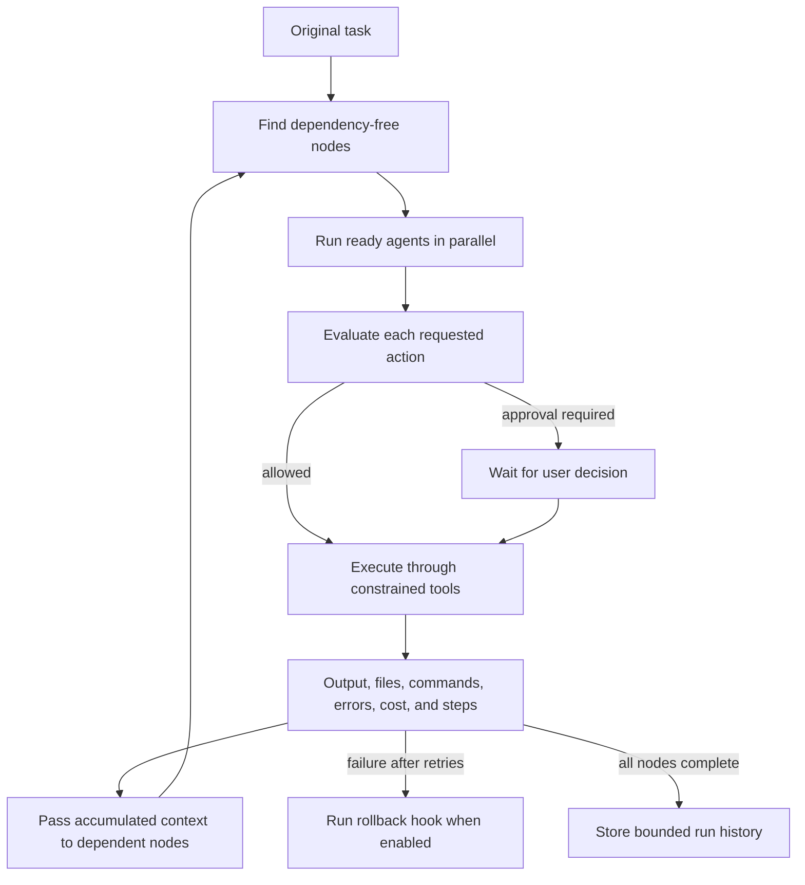

# Agents and workflows

An agent definition combines a role, provider/model choice, system prompt, allowed tools and folders,
cost/time limits, memory scope, autonomy, terminal permission, and edit permission. The workflow
engine consumes definitions without giving them unrestricted operating-system access.

## Built-in agents

| Agent                | Purpose                                           | Default autonomy |
| -------------------- | ------------------------------------------------- | ---------------- |
| Architect            | Define boundaries and an implementation plan      | Guided           |
| Frontend Developer   | Build accessible, responsive interfaces           | Guided           |
| Backend Developer    | Build validated services and domain logic         | Guided           |
| Debugger             | Reproduce failures and identify root causes       | Ask              |
| Reviewer             | Review correctness, security, and maintainability | Guided           |
| Tester               | Create and run risk-proportional tests            | Guided           |
| Documentation Writer | Keep behavior and limits documented               | Guided           |
| Security Auditor     | Audit permissions, secrets, and attack surfaces   | Ask              |
| DevOps               | Build CI and confirmed deployment plans           | Ask              |
| Project Manager      | Organize scope and acceptance criteria            | Guided           |

Defaults use Ollama's `default` model, a USD 2 run budget, a three-minute timeout, run-scoped memory
with at most 20 entries, and workspace-relative folders. Users can override these values or create a
custom agent in the Agents panel.

Custom definitions use the same complete form as built-ins. The panel edits provider, model, system
prompt, tools, folders, autonomy, terminal/edit permissions, cost, timeout, and memory scope. Removing
a custom definition also removes its nodes and connections from the active team.

## Autonomy levels

- **Ask:** every action waits for approval.
- **Guided:** safe actions can proceed; important or destructive actions wait for approval.
- **Autonomous:** actions can proceed inside the declared permissions, but global security invariants
  still apply. It is not unrestricted execution.

An agent's autonomy cannot grant a tool, folder, terminal level, or edit level omitted from its
definition. Production deployment, repository push, pull-request creation, credential access, and
blocked destructive commands retain their separate gates.

## Workflow data flow



Nodes without an unmet dependency form a parallel stage. Dependent nodes receive the original task,
previous results, changed files, errors, and relevant key/value context. Runs enforce workflow-wide
cost, time, step, retry, and cancellation limits. Events make active work, file access, proposed
commands, elapsed time, and spend visible to the UI.

Timeout is active cancellation, not only a UI status: the workflow aborts the running attempt and the
main service forwards cancellation to the provider request. Retry creates a fresh abort scope. User
cancellation stops queued work and active provider streams.

## Team templates

The visual workflow panel includes Full Stack App, Landing Page, Bug Fix, Code Review, Test Generator,
Documentation, and Deploy templates. Nodes can be dragged and connected into a directed acyclic graph.
Cycles and missing agent references are rejected before execution.

The builder shows queued, running, completed, and failed nodes. Each completed node exposes output,
attempts, duration, steps, estimated cost, files read, proposed files, commands, actions, and errors.
Connections can be removed without deleting agents. Run history is bounded and expandable; rollback
is available when the workflow requested it and a rollback hook exists.

## Action execution and memory

Provider text is untrusted. Structured actions are parsed in the main process and checked against the
agent definition, autonomy policy, global command classifier, and active workspace. A model-supplied
risk label is never authoritative.

- Read actions use the workspace filesystem service.
- Edit actions become pending review proposals even after action approval; they do not write files.
- Command actions are tokenized without a shell and may use only the agent command allowlist.
- Tool actions remain approved intents until a dedicated integration handles them.
- Approval events never expose proposed file content to the renderer.

Project memory is keyed by a hash of the real workspace path so two projects cannot share entries.
Run memory is discarded after the run; `none` disables memory. History and memory are bounded,
sanitized, owner-only local JSON records written through temporary files and atomic rename.

## Version-control options

An agent task may create a local checkpoint, isolated branch, reviewed Conventional Commit, and draft
pull request. Push and pull-request creation each require their own explicit task-level confirmation.
No autonomy level enables push by default.

## Adding an agent programmatically

Add a definition through `packages/agents/src/defaults.ts` using the complete contract:

```typescript
const accessibilityReviewer: AgentDefinition = {
  id: 'accessibility-reviewer',
  name: 'Accessibility Reviewer',
  description: 'Reviews keyboard, semantics, contrast, and assistive technology behavior.',
  providerId: 'ollama',
  model: 'default',
  systemPrompt: 'Review accessibility with evidence. Propose changes; do not apply them silently.',
  allowedTools: ['read-files', 'search', 'tests', 'preview'],
  allowedFolders: ['.'],
  costLimitUsd: 1,
  timeoutMs: 120_000,
  memory: { enabled: true, scope: 'run', maxEntries: 12 },
  autonomy: 'ask',
  terminalPermission: 'none',
  editPermission: 'propose',
  builtIn: true,
};
```

Register it in `builtInAgents`, add workflow-template references only after the ID exists, and test its
policy decisions and serialization in `packages/agents/src/index.test.ts`. A user-created agent uses
the same fields with `builtIn: false` and remains subject to the same global controls.
