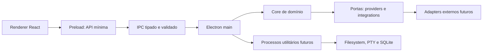

# Arquitetura inicial

## Princípios

- domínio independente de UI e fornecedores externos;
- privilégios mínimos entre renderer, preload e main;
- contratos explícitos nas fronteiras de IPC e integrações;
- recursos pesados e efeitos colaterais carregados sob demanda;
- observabilidade local sem coletar conteúdo do usuário por padrão.

## Visão de componentes

O renderer nunca importa Electron, filesystem, shell, PTY ou SDKs de fornecedores. O preload
expõe somente capacidades nomeadas. O main valida pedidos e delega trabalho bloqueante ou de maior
risco a processos utilitários.

O onboarding segue a mesma fronteira: renderer envia intents tipadas, preload expõe métodos
nomeados e main resolve adapters. Não existe canal IPC de execução genérica.

## Responsabilidades dos pacotes

| Pacote         | Responsabilidade                             | Não deve conhecer               |
| -------------- | -------------------------------------------- | ------------------------------- |
| `types`        | contratos de dados estáveis e serializáveis  | Electron, React, SDKs           |
| `core`         | regras de domínio puras                      | UI e adapters concretos         |
| `agents`       | lifecycle e orquestração futura              | componentes React               |
| `providers`    | portas e catálogo de capacidades de IA       | telas e credenciais em claro    |
| `integrations` | portas para CLI, deploy e source control     | implementação do renderer       |
| `config`       | constantes e configuração compartilhada      | segredos                        |
| `ui`           | componentes visuais sem regra de domínio     | filesystem e processos          |
| `apps/desktop` | composição Electron e experiência local      | lógica específica de fornecedor |
| `apps/landing` | presença web e comunicação pública           | APIs privilegiadas desktop      |
| `apps/ui-docs` | catálogo leve dos componentes compartilhados | regras de domínio               |

Fluxo de dependência permitido: `apps -> features/adapters -> ports/core -> types`. Dependências
circulares entre pacotes são proibidas.

## Dados e comunicação futuros

- IPC usa canais registrados, payloads versionados e schemas runtime; nunca um executor genérico.
- SQLite armazena configurações e metadados, com migrations monotônicas e transações.
- segredos ficam no keychain do sistema e chegam ao adapter somente no momento do uso.
- WebSocket serve a eventos remotos; comunicação interna local prefere IPC do Electron.
- respostas de IA são normalizadas em eventos canônicos antes de alcançar a UI.

## Escalabilidade

A escala relevante é de integrações e fluxos, não apenas volume. Adapters isolam mudanças de SDK;
capability discovery evita condicionais por fornecedor; processos utilitários mantêm UI responsiva;
lazy loading reduz custo inicial; filas com cancelamento e backpressure limitam streams e agentes.

## Estratégia de testes

- unitários para regras de domínio, parsers, policies e registries;
- contratos para IPC, providers e integrations;
- integração para filesystem, SQLite, PTY e adapters mockados;
- Playwright para jornadas críticas da landing e, depois, do Electron;
- smoke tests de artefatos empacotados nas plataformas suportadas.

Decisões com trade-offs duradouros estão registradas em [`decisions`](./decisions/README.md).

Detalhes da composição visual e seus estados estão em
[`desktop-interface.md`](./desktop-interface.md).
O fluxo de configuração, permissões e credenciais está em [`onboarding.md`](./onboarding.md).
