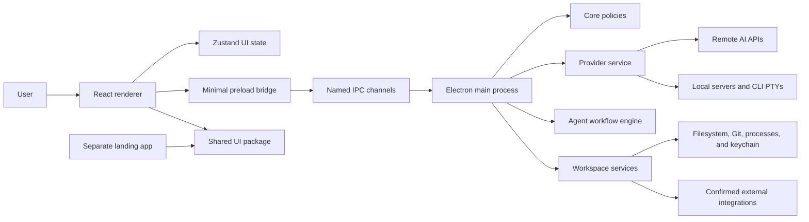

# Architecture

## Principles

- Keep domain rules independent from React, Electron, and individual vendors.
- Give the renderer the minimum possible privilege.
- Make IPC, provider, agent, and integration boundaries explicit and typed.
- Represent commands as executable/argument arrays, never renderer-provided shell strings.
- Keep remote side effects reviewable and require fresh confirmation for sensitive actions.
- Store content locally by default and do not collect workspace content as telemetry.

## System overview

The renderer never imports Electron, Node.js filesystem APIs, shell APIs, `node-pty`, or provider
SDKs. The preload exposes only named methods. Main-process handlers validate payloads, re-check
trusted workspace state, and delegate to a service with a narrow responsibility.

## Runtime boundaries

| Boundary        | Responsibility                                                      | Must not do                                                      |
| --------------- | ------------------------------------------------------------------- | ---------------------------------------------------------------- |
| Renderer        | Render UI, collect intent, keep non-secret view state               | Read secrets, execute commands, trust its own path checks        |
| Preload         | Translate typed renderer calls to named IPC                         | Expose `ipcRenderer`, `shell`, `fs`, or arbitrary channel access |
| Main IPC        | Validate payload shape and authorization                            | Forward unchecked renderer objects                               |
| Main services   | Own filesystem, process, Git, provider, preview, and deploy effects | Return raw secrets or unsanitized logs                           |
| Shared packages | Define reusable contracts and pure policy                           | Depend on Electron UI composition                                |
| Landing         | Public website built separately                                     | Import desktop privileges or local APIs                          |

## Package responsibilities

| Package                      | Owns                                                                 | Does not own                       |
| ---------------------------- | -------------------------------------------------------------------- | ---------------------------------- |
| `@visualnscode/types`        | Stable serializable cross-package contracts                          | Electron or React types            |
| `@visualnscode/core`         | Pure command, permission, project, and safety rules                  | Concrete OS operations             |
| `@visualnscode/agents`       | Agent definitions, policy, workflows, and execution records          | Renderer components                |
| `@visualnscode/providers`    | Provider contracts, catalogs, HTTP/CLI adapters, fake provider       | Credential persistence or screens  |
| `@visualnscode/integrations` | Tool definitions, detection, command runner, deploy and VCS adapters | Renderer state                     |
| `@visualnscode/config`       | Shared constants                                                     | Secrets                            |
| `@visualnscode/ui`           | Reusable, unprivileged React components                              | Filesystem or provider logic       |
| `apps/desktop`               | Electron composition and local product experience                    | Vendor-specific domain rules in UI |
| `apps/landing`               | Public product site                                                  | Desktop IPC                        |
| `apps/ui-docs`               | Lightweight component catalog                                        | Product state                      |

Allowed dependency direction is `apps → adapters/features → ports/core → types`. Cycles between
packages are not allowed and `pnpm check:structure` verifies the required monorepo shape.

## Provider and chat path

Chat follows `renderer → preload → validated IPC → ProviderService → AIProvider`. The main process
retrieves a secret only while constructing the adapter. Remote context is scanned and redacted before
the request. Canonical chunks return through one event subscription; the renderer never sees a key.

## Agent execution path

Agent work follows `renderer → validated IPC → AgentService → workflow engine → provider and narrow
action adapters`. The pure engine owns graph ordering, parallel stages, retries, budgets, steps,
timeouts, cancellation, and execution records. `AgentService` owns provider composition, approval,
workspace-scoped memory, sanitized history, and optional version-control hooks.

An approved action does not become arbitrary system access. Reads use `FilesystemService`; edits
enter `FileEditService` as review proposals; commands pass through a shell-free, allowlisted agent
runner; provider cancellation is forwarded when a run or timeout aborts. The renderer receives
status and metadata, never secret content or an edit body in an approval event.

For rollback-enabled runs, the main process creates a checkpoint from readable files in the relevant
context before invoking a provider. A final failure restores that checkpoint even when the failing
agent did not produce a completed run record.

## Files, preview, and deployment

Runtime actions form a closed union: install, development, build, and test. The main process detects
the project again and maps the requested action to `spawn` arguments with `shell: false`. The preview
proxy accepts loopback origins only. Its injected browser bridge can report console, basic Fetch
activity, and selected DOM metadata through `postMessage`, but has no preload access.

Deployment is a separate remote-effect service. It builds a fixed plan, presents it for review,
requires confirmation in the main process, runs the build first when required, redacts output, and
writes bounded history.

Every spawned project, Git, integration, and deploy process receives a shared allowlisted environment
rather than the Electron process environment. Its PATH is augmented with standard package-manager and
version-manager locations because GUI applications do not inherit an interactive shell PATH. API
keys and service tokens remain excluded. Provider endpoints are normalized centrally; remote
execution requires HTTPS except for loopback development endpoints.

## State and persistence

- Zustand persists theme, interface mode, onboarding completion, and other non-secret preferences.
- Provider settings are stored separately from encrypted credentials.
- Electron `safeStorage` encrypts provider secrets; an unavailable encryption backend is an error.
- Chat, agent, checkpoint, and deploy histories are bounded local records. Agent history and memory
  use owner-only atomic JSON writes and project memory is isolated by a hashed workspace key.
- SQLite is planned for versioned metadata persistence; the current code does not claim that migration is complete.

## Scalability

Adapters isolate SDK and CLI changes. Capability discovery avoids vendor conditionals in the UI.
Cancellation, timeouts, concurrency limits, bounded histories, and workflow budgets constrain long
operations. Heavy resources are created in the main process and only when needed.

The Simple workspace does not import Monaco: the complete Advanced IDE, editor integration, language
workers, and diff UI are loaded through a separate dynamic chunk only after the mode changes.

## Verification

- Unit tests cover pure policies, provider normalization, agent execution, and renderer behavior.
- Integration tests exercise main-process services with fake runners, filesystems, and providers.
- Playwright and Axe cover landing journeys and accessibility.
- Lighthouse CI enforces landing quality budgets.
- Platform packaging runs only from a manually triggered release workflow.
- `pnpm test:coverage` produces separate unit and integration reports; current gaps are documented in
  the [final audit](./audit-report.md).

Durable trade-offs are recorded in the [ADR index](./decisions/README.md). Security invariants are
expanded in the [security model](./security-model.md).
