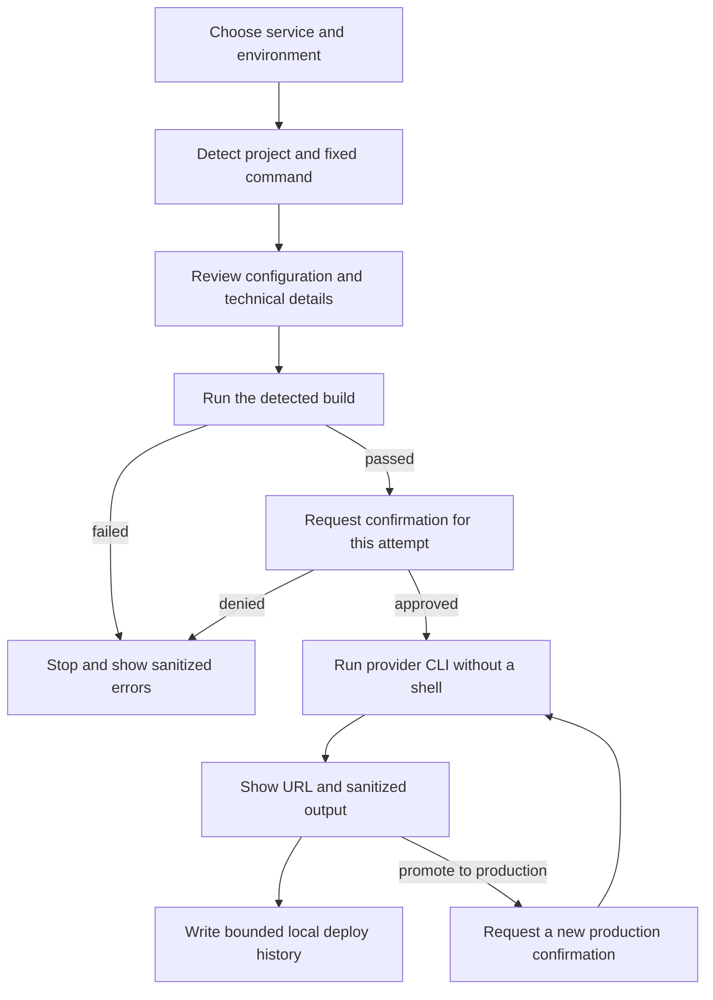

# Project execution, preview, and deployment

VisualnsCode detects a project from the open workspace. The renderer requests a named action; it never
sends an arbitrary shell command. The main process detects the project again and maps the action to a
fixed executable and argument array.

## Runtime detection

| Project signal                           | Runtime or manager     | Detected actions                                            | Typical port       |
| ---------------------------------------- | ---------------------- | ----------------------------------------------------------- | ------------------ |
| `pnpm-lock.yaml`                         | pnpm                   | install plus package scripts for dev/start, build, and test | Framework-specific |
| `yarn.lock`                              | Yarn                   | install plus package scripts                                | Framework-specific |
| `bun.lock` or `bun.lockb`                | Bun                    | install plus package scripts                                | Framework-specific |
| `package-lock.json` or `package.json`    | npm                    | install plus package scripts                                | Framework-specific |
| `pyproject.toml` or a Python entry point | Python                 | install, server/entry point, pytest                         | 5000 or 8000       |
| `index.html` without a runtime manifest  | Built-in static server | development preview                                         | 4173               |

Vite defaults to 5173, Next.js and Create React App to 3000, and Astro to 4321. An explicit `--port`,
`-p`, or `PORT=` in the detected script wins. Processes can start, stop, and restart while stdout and
stderr stream separately into the runtime log.

## Integrated preview

The Preview panel provides desktop, tablet, mobile, and custom dimensions plus refresh, external
browser, screenshot, console, and basic Fetch network events. The page runs through an ephemeral
loopback proxy that accepts only `localhost`, `127.0.0.1`, and `::1` origins.

The proxy injects a small browser bridge. It communicates through `postMessage` and has no Electron,
filesystem, credential, or command API. Element selection sends the reviewed page URL, CSS selector,
tag, visible text, classes, selected attributes, and bounds to the chat draft. Any requested code
change still uses the proposal and diff review flow.

## Supported deploy targets

| Service          | Preview                                               | Production                                    |
| ---------------- | ----------------------------------------------------- | --------------------------------------------- |
| Vercel           | Confirmed preview deploy                              | Separately confirmed `--prod` deploy          |
| Firebase Hosting | Isolated preview channel                              | Hosting-only deploy                           |
| Supabase         | Edge Function deploy for a selected project reference | Same operation marked production              |
| GitHub Pages     | Existing configured workflow                          | Existing workflow with production environment |

The corresponding CLI must already be installed and authenticated. Supabase needs a project reference
and function name. GitHub Pages needs an existing workflow; VisualnsCode does not silently generate or
modify repository automation during deployment.

## Deploy flow

Renderer state cannot bypass the main-process confirmation. A preview confirmation is never reused for
production, and VisualnsCode never retries a production deploy automatically.

## History and failures

Up to 100 records are stored in `.visualnscode/deploy-history.json` with restrictive permissions.
Records contain provider, environment, status, timestamps, summary, and returned URL. CLI output is
redacted before it reaches UI or history. A failed build prevents deploy; a failed deploy creates a
failed record with sanitized diagnostics.

The VisualnsCode landing page has a separate Vercel process documented in [Landing](./landing.md).
