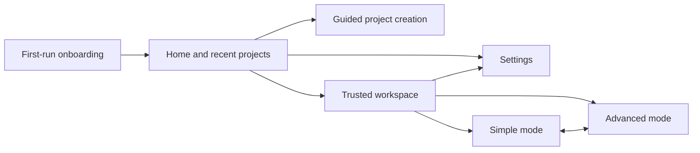

# Desktop interface

The desktop app uses progressive disclosure. Simple mode is not an IDE: it presents the running
result, preview controls, and a plain-language project assistant. Advanced mode is the IDE, with
Explorer, Monaco, terminal, Git, logs, diffs, tasks, agents, models, settings, and permissions. Both
modes use the same trusted workspace and running process.

The Advanced bottom panel already presents runtime, task, log, and Git surfaces. Its generic
interactive terminal is not complete in the current alpha and is tracked in the roadmap.

## Navigation

The home screen opens folders, begins guided creation, starts a confirmed GitHub clone, and lists
recent projects. Settings controls theme, interface mode, providers, permissions, and onboarding.
The light/dark theme switch remains available in both Simple and Advanced workspace headers. The
persisted preference can be System, Dark, or Light. System follows `prefers-color-scheme`, reacts to
operating-system changes while the app is open, and updates every application surface and Monaco.

## Simple project experience

- Integrated preview as the primary surface, including run, stop, restart, responsive sizes, element
  selection, logs, screenshots, and confirmed deployment.
- Project assistant with provider details collapsed into a quiet status line.
- Plain-language prompts and an explicit reminder that edits still require review.
- One action to reveal Advanced tools; no file tree, code editor, terminal, or technical status bar.

## Advanced workspace composition

- Full Explorer and activity rail.
- Monaco editor with file tabs, empty/loading/error states, and manual save.
- Streaming chat with provider/model selection and explicit context files. The provider picker always
  lists the complete catalog, uses the matching provider icon, and explains whether an unavailable
  option needs an API key, a running local server, CLI setup, or activation.
- Preview with process controls, responsive sizes, diagnostics, screenshot, and element selection.
- Diff review for AI proposals and checkpoint rollback.
- Advanced bottom panel for runtime output, tasks, logs, Git, and the planned interactive terminal.
- Status bar showing workspace and runtime state.

Advanced panels use the shared `ResizeHandle` from `packages/ui`. Pointer and keyboard resizing expose separator
semantics and enforce useful minimum/maximum sizes. Secondary controls collapse at smaller desktop
window widths without replacing the editor with a mobile layout. The Simple result/assistant split
uses a stable two-column desktop layout.

The Advanced workspace is a lazy module. Opening a project in Simple mode does not initialize Monaco
or fetch its language workers; changing mode shows a short loading state and then keeps the IDE chunk
available for the session.

## State ownership

`store.ts` owns navigation and persisted preferences such as theme, mode, onboarding completion, and
YOLO acknowledgement. `workspace-store.ts` owns open documents, tabs, panel visibility, and active
workspace UI state. Privileged or authoritative state remains in main-process services.

Opening an already open file activates its existing tab. Closing the active tab selects a neighbor or
shows the empty state. Command/Control+S invokes the safe file writer for a manual editor change. AI
proposals are never saved by that shortcut; they remain in the dedicated review flow.

## Shortcuts

| Shortcut              | Action                               |
| --------------------- | ------------------------------------ |
| Command/Control+B     | Toggle Explorer                      |
| Command/Control+J     | Toggle bottom panel                  |
| Command/Control+,     | Open Settings                        |
| Command/Control+Enter | Run or open preview                  |
| Command/Control+S     | Save the active manually edited file |

## Shared UI catalog

Buttons, icon buttons, selects, segmented controls, surfaces, state displays, and resize handles live
in `packages/ui`. `apps/ui-docs` is the lightweight Storybook alternative and runs with `pnpm dev:ui`.

Renderer tests mock Monaco for speed and cover the no-IDE Simple surface, panel visibility, theme
persistence, mode switching, guided project creation, file opening, tabs, onboarding, chat, editing,
agents, preview context, and version control. The desktop production build validates the real Monaco
integration.
