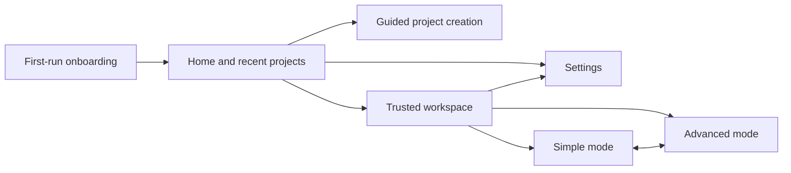

# Desktop interface

The desktop app uses progressive disclosure: Simple mode emphasizes the editor, important files,
chat, preview, Run, and Undo; Advanced mode adds terminal, Git, logs, diffs, tasks, agents, models,
advanced settings, and permissions. Both modes use the same workspace and documents.

## Navigation

The home screen opens folders, begins guided creation, starts a confirmed GitHub clone, and lists
recent projects. Settings controls theme, interface mode, providers, permissions, and onboarding.

## Workspace composition

- Explorer with important-file filtering in Simple mode and the full tree in Advanced mode.
- Monaco editor with file tabs, empty/loading/error states, and manual save.
- Streaming chat with provider/model selection and explicit context files.
- Preview with process controls, responsive sizes, diagnostics, screenshot, and element selection.
- Diff review for AI proposals and checkpoint rollback.
- Advanced bottom panel for terminal, tasks, logs, Git, and other tools.
- Status bar showing workspace and runtime state.

Panels use the shared `ResizeHandle` from `packages/ui`. Pointer and keyboard resizing expose separator
semantics and enforce useful minimum/maximum sizes. Secondary controls collapse at smaller desktop
window widths without replacing the editor with a mobile layout.

## State ownership

`store.ts` owns navigation and persisted preferences such as theme, mode, onboarding completion, and
YOLO acknowledgement. `workspace-store.ts` owns open documents, tabs, panel visibility, and active
workspace UI state. Privileged or authoritative state remains in main-process services.

Opening an already open file activates its existing tab. Closing the active tab selects a neighbor or
shows the empty state. Command/Control+S invokes the safe file writer for a manual editor change. AI
proposals are never saved by that shortcut; they remain in the dedicated review flow.

## Shortcuts

| Shortcut              | Action                               |
| --------------------- | ------------------------------------ |
| Command/Control+B     | Toggle Explorer                      |
| Command/Control+J     | Toggle bottom panel                  |
| Command/Control+,     | Open Settings                        |
| Command/Control+Enter | Run or open preview                  |
| Command/Control+S     | Save the active manually edited file |

## Shared UI catalog

Buttons, icon buttons, selects, segmented controls, surfaces, state displays, and resize handles live
in `packages/ui`. `apps/ui-docs` is the lightweight Storybook alternative and runs with `pnpm dev:ui`.

Renderer tests mock Monaco for speed and cover panel visibility, theme persistence, mode switching,
file opening, tabs, onboarding, chat, editing, agents, preview context, and version control. The
desktop production build validates the real Monaco integration.
