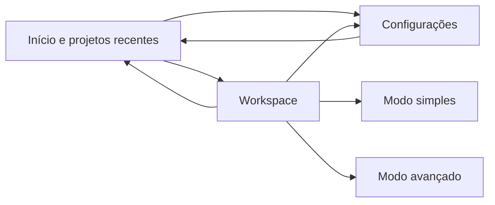

# Arquitetura da interface desktop

## Objetivo da fase

Validar a experiência principal antes de conceder acesso a filesystem, terminal, providers ou
serviços externos. Todas as informações de projeto e respostas do chat são demonstrações locais.
Nenhum botão desta fase executa comandos, clona repositórios ou transmite conteúdo.

## Superfícies

- **Início:** ações primárias, feedback amigável e projetos recentes demonstrativos.
- **Configurações:** tema e nível da interface; preferências são persistidas em local storage.
- **Workspace:** composição de arquivos, editor, assistência e preview com progressive disclosure.

## Modos de experiência

O modo simples reduz a árvore aos arquivos importantes e mantém editor, chat/preview, executar e
desfazer. O modo avançado revela activity rail, todos os arquivos, minimap, painel inferior,
agente, modelo, Git, logs, diffs, tarefas e permissões. Ambos usam o mesmo documento e estado; a
alternância não recarrega o workspace.

## Estado

`store.ts` contém navegação e preferências persistidas (`theme` e `mode`).
`workspace-store.ts` contém documentos demonstrativos, abas e visibilidade dos painéis. Conteúdo de
documentos não é persistido nesta fase para não confundir mocks com um workspace real.

O Monaco recebe o documento ativo como valor controlado. Abrir um arquivo garante uma única aba;
fechar a aba ativa escolhe uma vizinha ou apresenta o estado vazio. Desfazer restaura o conteúdo
inicial do arquivo de demonstração.

## Painéis e responsividade

Explorador, painel direito e painel inferior usam `ResizeHandle` de `packages/ui`. O componente
suporta pointer e teclado, expõe semântica `separator` e aplica limites para evitar áreas
inutilizáveis. A janela Electron mantém dimensões mínimas; controles secundários se recolhem em
larguras menores e áreas centrais usam `min-width: 0` para preservar o editor.

## Atalhos

| Atalho             | Ação                     |
| ------------------ | ------------------------ |
| `Cmd/Ctrl + B`     | alternar explorador      |
| `Cmd/Ctrl + J`     | alternar painel inferior |
| `Cmd/Ctrl + ,`     | abrir configurações      |
| `Cmd/Ctrl + Enter` | executar/abrir preview   |

Atalhos atuam apenas enquanto o workspace está montado e sempre previnem o comportamento nativo
quando reconhecidos.

## Componentes visuais

Primitivas vivem em `packages/ui`: botões, icon button, select, segmented control, surface, estados
vazio/erro/carregando e resize handle. O app `apps/ui-docs` é uma alternativa leve ao Storybook e
pode ser iniciado com `pnpm dev:ui`.

## Testes

Vitest, Testing Library e jsdom cobrem abertura/fechamento de painéis, troca e persistência de tema,
modo simples/avançado, abertura de arquivos e ciclo das abas. Monaco é substituído por um textarea
nos testes para manter a suíte rápida e determinística. O build real continua validando a
integração com Monaco.
