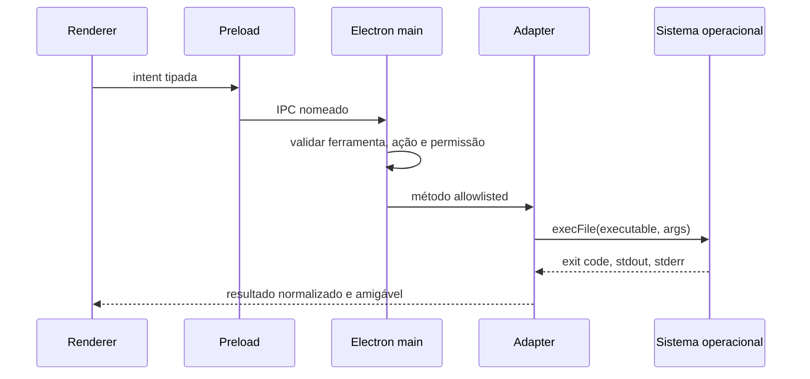

# Assistente de configuração inicial

## Fluxo

O assistente aparece enquanto `onboardingCompleted` for falso e pode ser reaberto em Configurações.
O modo selecionado e a conclusão são persistidos localmente; resultados de detecção são efêmeros.

1. boas-vindas e garantias de segurança;
2. modo simples ou avançado;
3. Git;
4. GitHub CLI, conta, repositórios e identidade Git;
5. Node.js;
6. pnpm, npm, Yarn e Bun;
7. Firebase CLI;
8. Vercel CLI;
9. Supabase CLI e Docker;
10. providers locais e credenciais remotas;
11. Claude Code, Codex CLI, Gemini CLI, Aider e OpenCode;
12. resumo e entrada no aplicativo.

Também são detectados Python, Ollama e LM Studio pelo catálogo. A tela mostra instalação, versão,
caminho, teste, documentação e ignorar.

## Pipeline seguro

O runner não usa shell, redirecionamento, pipe, interpolação ou script recebido do renderer. PATH e
variáveis de ambiente são filtrados. Saída é limitada a 64 KiB e toda ação tem timeout.

## Permissões

| Permissão             | Padrão | Uso                                          |
| --------------------- | ------ | -------------------------------------------- |
| leitura               | sim    | caminhos, versões e arquivos do projeto      |
| escrita               | não    | arquivos dentro do workspace                 |
| comandos seguros      | sim    | detecção e testes sem mutação                |
| instalar dependências | não    | Homebrew/npm após confirmação                |
| fora do projeto       | não    | configuração global do Git                   |
| credenciais           | não    | login e cofre do sistema                     |
| administrador         | não    | reservado; receitas atuais não usam elevação |

Permissão não substitui confirmação. Instalações, login, logout, configuração, vínculo, migrations
e deploy precisam de ação individual. Produção Vercel é classificada como destrutiva.

## Integrações

- **GitHub:** login web, status, username, repositórios, logout e identidade Git.
- **Firebase:** instalação, login, projetos, seleção e init de Hosting, Firestore e Authentication.
- **Vercel:** login, conta, projetos, vínculo, criação, preview e produção.
- **Supabase:** Homebrew no macOS, login, projetos, vínculo, stack Docker, migrations e tipos.

Ações de escrita de Firebase, Vercel e Supabase exigem um workspace real confiável. Durante o
onboarding elas explicam esse requisito e não aceitam um caminho arbitrário do renderer.

## Credenciais

OpenAI, Anthropic e Google AI usam `safeStorage`. O renderer envia a chave somente ao salvar, limpa
o input e depois recebe apenas o estado configurado. Backend sem criptografia real é recusado.
Ollama e LM Studio são detectados como providers locais sem token.

## Testes

`MockCommandRunner` substitui `execFile`. A suíte valida os 19 itens, versões, username GitHub,
projetos Firebase, risco do deploy Vercel, bloqueio Supabase sem workspace e permissões. Testing
Library cobre primeira abertura, modo, drawer de permissões e conclusão. Nenhum teste abre login,
rede de provider ou processo local real.
