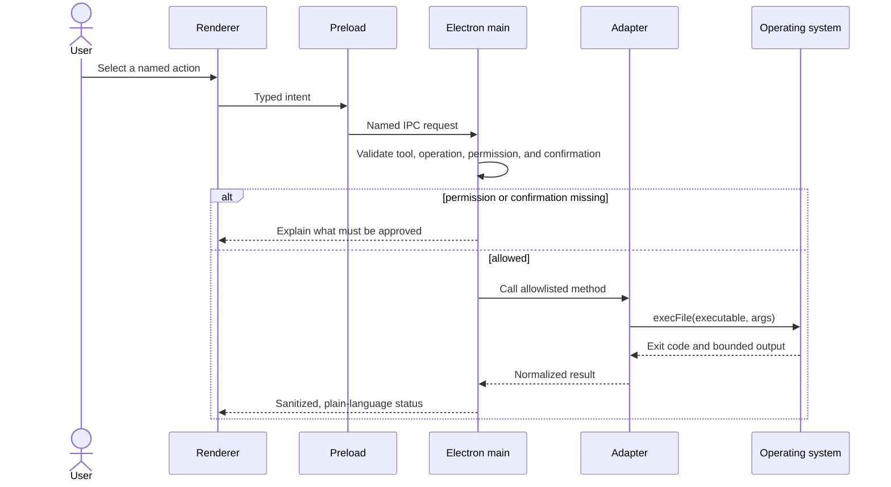

# Environment onboarding

The first-run assistant remains visible until the persisted `onboardingCompleted` preference is true.
It can be reopened from Settings. Mode choice and completion persist; detection results are refreshed
from the current machine.

## Steps

1. Welcome and safety guarantees.
2. Simple project/preview experience or the full Advanced IDE.
3. Git.
4. GitHub CLI, account access, repositories, and Git identity.
5. Node.js.
6. pnpm, npm, Yarn, and Bun.
7. Firebase CLI.
8. Vercel CLI.
9. Supabase CLI and Docker.
10. Local providers and encrypted remote-provider keys.
11. Claude Code, Codex CLI, Gemini CLI, Aider, and OpenCode.
12. Summary and entry into the application.

Python, Ollama, and LM Studio are also included in the 19-tool catalog. Each tool reports installed,
missing, or error status; version; resolved path; test action; supported installer; official
documentation; and ignore action. Errors use plain language and keep technical output available for
inspection.

## Configuration flow

The runner does not use shell interpolation, pipes, redirects, or a script supplied by the renderer.
Commands have timeouts and bounded output.

## Permissions

| Permission           | Default | Used for                                            |
| -------------------- | ------- | --------------------------------------------------- |
| Read                 | Granted | Tool versions and project information               |
| Write                | Denied  | Files and configuration inside a trusted workspace  |
| Execute safe         | Granted | Read-only detection and tests                       |
| Install dependencies | Denied  | Catalog-defined Homebrew or npm installs            |
| Outside workspace    | Denied  | Global Git identity and other external paths        |
| Credentials          | Denied  | Login, account tests, and secure storage            |
| Administrative       | Denied  | Reserved; current recipes do not elevate privileges |

Granting a permission does not confirm an individual side effect. Install, login, logout,
configuration, linking, migration, project creation, and deployment still require a separate user
action. Production deployment receives the strictest confirmation.

## Credentials

Remote provider keys are encrypted through Electron `safeStorage`. When saving, the renderer clears
the input and subsequently receives only configuration status. If secure OS encryption is unavailable,
credential storage fails closed. Ollama and LM Studio can be configured without a token.

## Tests

Integration tests replace operating-system execution with a fake `CommandRunner`. They cover all 19
tool definitions, version and path results, GitHub identity, service project listing, Vercel production
risk, Supabase workspace requirements, and permission denial. Renderer tests cover first launch, mode
selection, the permission drawer, and completion without opening a real login or network request.
