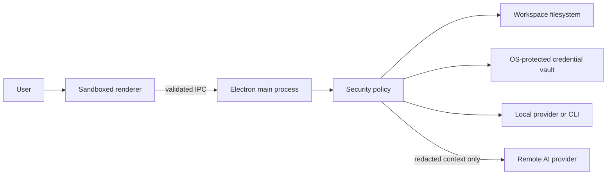
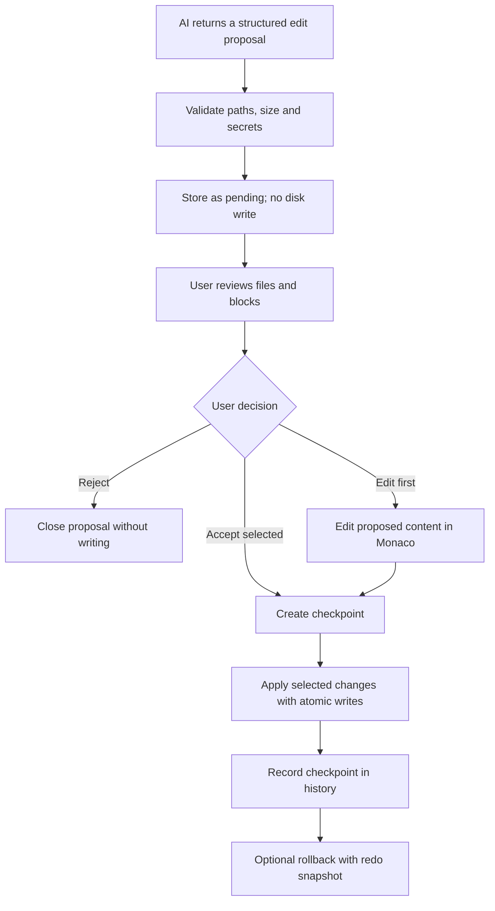

# Security Model

VisualnsCode treats AI output as untrusted input. An AI provider or agent can propose a file change,
but it cannot write that change through the renderer or agent protocol. The main process keeps the
proposal until the user reviews it.

## Trust boundaries



The renderer has `nodeIntegration` disabled, `contextIsolation` enabled, and Electron sandboxing
enabled. A restrictive Content Security Policy blocks unapproved script, object, form, frame, and
connection sources. Filesystem, checkpoint, command, provider, and credential operations cross an
explicit preload API. The main process validates IPC payload size and shape again before using them.

## AI edit flow



Review supports:

- side-by-side Monaco diff;
- unified diff;
- file selection;
- block selection;
- editing the proposed version before applying;
- accept selected or reject all;
- persistent checkpoint history and rollback.

Agent autonomy does not bypass this flow. An agent `edit` action must include a relative path and
the full proposed content. Ask or Guided autonomy may require an action approval first; after that,
the content still becomes a pending visual proposal. It is not written automatically.

## Workspace isolation

Every path must be relative to the open workspace. `FilesystemService` performs both checks:

1. lexical resolution rejects absolute paths, null bytes, and `..` traversal outside the root;
2. real-path resolution verifies the existing target or nearest existing parent remains under the
   real workspace root.

Direct symbolic-link targets are rejected. A path that enters a symlinked parent is resolved with
`realpath`; if the destination is outside the workspace, the operation is rejected. File writes use
a temporary file in the same directory followed by an atomic rename, and will not overwrite a
symlink.

Directory deletion requires explicit confirmation. The workspace root cannot be deleted, and a
single directory operation is blocked when it contains more than 20 entries. AI proposals can
request at most three file deletions and 25 changed files at once.

## Sensitive files and secret redaction

These paths are protected from renderer reads, AI proposals, and overwrites:

- `.env` variants, except `.env.example`;
- `.ssh` content and common private-key names such as `id_rsa` and `id_ed25519`;
- `.netrc`, `.npmrc`, `.pypirc`, credential and service-account JSON files;
- PEM, KEY, P12, PFX, JKS, keystore, CRT, and CER files;
- Firebase Admin service-account files.

Content scanning detects common OpenAI, Anthropic, Google, AWS, and GitHub credentials, bearer
tokens, credential assignments, private-key headers, and database URLs with embedded passwords.

Before a remote provider receives a request:

- message text is redacted;
- sensitive context files are replaced with `[SENSITIVE FILE OMITTED]`;
- detected values in normal files are replaced with `[REDACTED]`;
- only the redacted copies leave the main process.

Local providers and CLIs do not require remote redaction, but their access is still constrained by
their configured permissions. Provider logs use a separate recursive sanitizer and never include
stored API keys.

Remote provider endpoints must use HTTPS. Plain HTTP is accepted only for loopback or a provider
explicitly classified as local. User information in an endpoint URL is rejected so credentials cannot
leak through URL persistence or error messages.

## Preview and deployment boundaries

The integrated preview accepts only HTTP(S) loopback origins: `localhost`, `127.0.0.1`, and `::1`.
An ephemeral reverse proxy injects the inspection bridge into HTML and forwards assets to that fixed
origin. The iframe remains sandboxed. The bridge can observe DOM metadata, console calls, and Fetch
results, but it communicates only through `postMessage` and cannot call preload APIs. Element context
contains selector, visible text, limited attributes, and geometry; it does not read local files.

Screenshot capture is performed by Electron only after the renderer provides a bounded rectangle.
The image is written only after a native save dialog returns a user-selected path.

Deploy plans use fixed CLI executable and argument arrays. Preview and production both require
confirmation; production confirmation is checked again in the main process. A detected build must
succeed first. CLI output passes through secret redaction before display, and deploy history contains
only status metadata and returned URLs. VisualnsCode does not retry, promote, or publish production
automatically.

## Command classification

| Class       | Examples                                                                                                  | Default behavior                             |
| ----------- | --------------------------------------------------------------------------------------------------------- | -------------------------------------------- |
| `safe`      | read-only local commands                                                                                  | allowed                                      |
| `confirm`   | dependency installation, regular Git push, deletion, network download                                     | explicit confirmation                        |
| `dangerous` | administrative commands, force push, package publication, external file upload, write to an absolute path | reinforced confirmation; YOLO cannot skip it |
| `blocked`   | recursive-force `rm`, `del /s`, `rmdir /s /q`, `format`, `diskpart`, `mkfs`, destructive `dd`, `shutdown` | rejected; cannot be overridden               |

The integrated project runner accepts only named install, development, build, or test actions
detected from the current project. It starts the executable without a shell, which prevents a
renderer payload from appending shell operators. Child processes receive an allowlisted environment
containing runtime paths, locale, temporary directories, terminal metadata, and optional SSH-agent
socket information. API keys, CI tokens, and deploy credentials are never inherited. Authenticated
CLIs must use their own credential store.

Workspace-writing Firebase, Vercel, and Supabase actions resolve the requested working directory to a
real path. It must be the active workspace or one of its descendants unless the user granted the
dedicated outside-workspace permission.

Git and GitHub use a second fixed command boundary. The renderer selects named operations, while the
main process builds argument arrays for `git` or `gh` and validates paths, refs, text lengths, and
confirmation flags. Hard reset and force push are not exposed. Pull uses `--ff-only`. Push, merge,
revert, repository creation, fork, clone, issues, pull requests, and releases require an explicit
action; every remote mutation also carries a confirmation checked by the service itself.

## YOLO mode

YOLO mode is disabled globally by default. Enabling it requires two separate states:

1. allow YOLO on the current device;
2. accept the warning shown when activating it.

While active, a persistent workspace banner provides a one-click disable action. YOLO may skip
confirmation only for the `confirm` class. It does not skip reinforced confirmation for
`dangerous` commands and cannot override `blocked` commands. Disabling the global permission also
turns off the active state and clears the acknowledgement.

## Checkpoints and snapshots

Before applying accepted files, VisualnsCode stores their previous content and whether each file
already existed. Checkpoint files are placed under `~/.visualnscode/checkpoints`, the directory is
restricted to mode `0700`, and each JSON file uses mode `0600` where the operating system supports
POSIX modes. A workspace keeps the newest 50 checkpoints.

A checkpoint is bound to the real workspace path. Restoring an ID created for another workspace is
rejected. Rollback first creates a new snapshot of the current state, so the user retains a redo
point. Files created by the original proposal are removed during rollback; files that existed are
restored through the same safe-write path.

Checkpoints are not encrypted. Sensitive files cannot enter the AI edit flow, but normal source
code may be present in checkpoints. Users with stronger local-storage requirements should protect
their OS account and home directory.

## Credential storage

API credentials are encrypted with Electron `safeStorage` and stored only when the platform reports
an encryption backend. Linux `basic_text` is explicitly rejected. Encrypted store files use mode
`0600`; decrypted values remain in the main process and are passed directly to the selected
provider adapter.

## Security tests

The unit and interface suites cover:

- traversal and absolute paths;
- direct and parent-directory symlink escapes;
- sensitive filename detection;
- multiple secret formats and remote-context redaction;
- safe, confirmation, dangerous, and blocked command classes;
- YOLO invariants;
- multi-block diff calculation and partial application;
- no-write-before-review behavior;
- checkpoint creation, new-file rollback, and workspace ownership;
- reject-all and visual rollback confirmation.

Run the security-focused tests with the normal test suite:

```bash
pnpm test
```

Before every push, the repository hook also runs:

```bash
pnpm security:audit
```

This scan checks tracked files and Git history for known credential formats. It complements runtime
redaction; it does not replace secret rotation after an accidental exposure.
